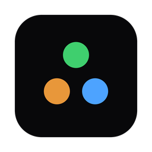
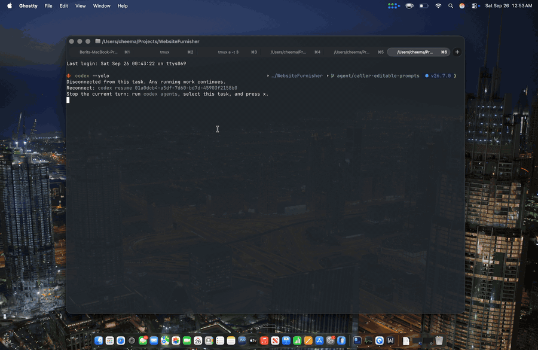

<div align="center">



<h3>agxntz</h3>

A menu bar monitor for your AI coding agents.

<hr width="140">

</div>

agxntz sits in the Mac menu bar and shows one dot per coding agent you have running:
green while it works, orange when it needs you, blue when it's done. Click the dots for
a list of every session, what it's doing right now and its latest message. Pin one to
keep its live activity scrolling in the menu bar.

[](https://agxntz.com/video/product-demo.mp4)

It works with Claude Code, Codex, OpenCode, Grok, pi and Oh My Pi, including their
sub-agents. It only reads the transcripts those agents already write to disk. It never
changes them and needs no plugins or hooks.

## Requirements

- macOS 14 or later

## Install

Download it from [agxntz.com](https://agxntz.com), open the dmg and drag the app to
Applications. It is signed and notarized, so it opens with no warning.

## Build from source

```sh
make run
```

That builds the app, puts it in `dist/agxntz.app` with Sparkle inside, signs it ad hoc and
opens it. `.build/release/agxntz --scan` prints one detection pass to the terminal.
Releases are signed, notarized and published by CI; see [docs/releasing.md](docs/releasing.md).

## Contributing

[CONTRIBUTING.md](CONTRIBUTING.md) has the checks to run before a pull request and the
house rules.

## License

MIT. See [LICENSE](LICENSE).
